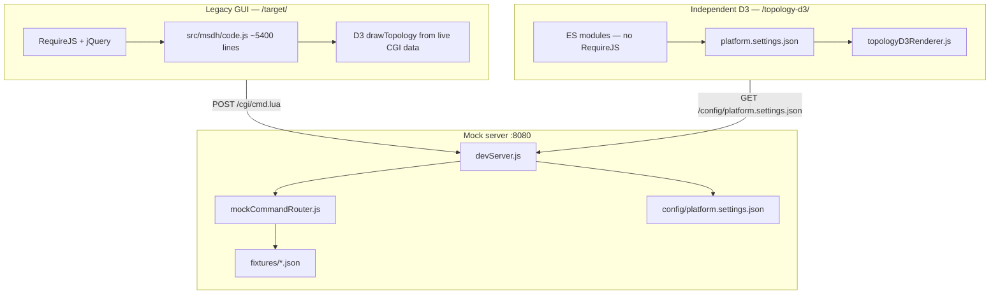

# idDAS Web GUI — Full Analysis & Documentation

> **The GUI covers full device lifecycle management:** provisioning, RF routing, device monitoring, alarms, configuration backup, software update, and system administration.

This document describes the `gui-sw-src` repository, the legacy production GUI, the `mock-client` dev stack, and the independent D3 topology page.

---

## Table of contents

1. [Repository purpose](#repository-purpose)
2. [High-level architecture](#high-level-architecture)
3. [Production legacy stack](#production-legacy-stack)
4. [Mock dev server](#mock-dev-server)
5. [Independent D3 topology page](#independent-d3-topology-page)
6. [Platform settings JSON](#platform-settings-json)
7. [Topology screenshot diagnosis](#topology-screenshot-diagnosis)
8. [Navigation menu](#navigation-menu)
9. [Naming conventions](#naming-conventions)
10. [Legacy vs D3 comparison](#legacy-vs-d3-comparison)
11. [Gaps and technical debt](#gaps-and-technical-debt)
12. [Recommended next steps](#recommended-next-steps)
13. [Key file map](#key-file-map)

---

## Repository purpose

Embedded web GUI for **Cobham / Axell idDAS** telecom hardware (MSDH-M controllers, MTDI, APOI, remote units). The production stack is static HTML served from the device, using **RequireJS + jQuery + D3 v3**, talking to on-box firmware through a **Lua CGI bridge** (`POST /cgi/cmd.lua` → Axell Shell commands).

The **`mock-client/`** directory adds a vanilla Node.js dev server that:

- Serves the **unmodified** legacy UI from `src/`
- Mocks the Lua CGI backend with JSON fixtures
- Provides an **independent D3 topology page** driven by a single platform settings JSON file

---

## High-level architecture



### URL map (dev server)

| URL | Stack | Data source |
|-----|-------|-------------|
| http://localhost:8080/target/ | Full legacy GUI | `fixtures/*.json` via mock CGI |
| http://localhost:8080/topology-d3/ | Vanilla JS + D3 | `config/platform.settings.json` |
| http://localhost:8080/config/platform.settings.json | Raw config | Single JSON file |
| http://localhost:8080/logs/ | Common legacy page | Mock CGI |
| POST http://localhost:8080/cgi/cmd.lua | Mock backend | `mockCommandRouter.js` |

---

## Production legacy stack

Every legacy page follows the same boot pattern:

1. `index.html` loads RequireJS with `data-main="/js/main.js"`
2. `main.js` bootstraps jQuery, API layer, cookies, operator polling
3. `/js/header.js` loads `/header.html` + `/target/header.html` (model-specific menu)
4. Page-specific `code.js` runs (e.g. `src/msdh/code.js` for topology — ~5400 lines)

### CGI request flow

```
Browser (RequireJS + jQuery)
  POST /cgi/cmd.lua { cmd: "operators --json" }
       ↓
/cgi/cmd.lua (WSAPI Lua on device)
       ↓
axsh / libAxshLua (device commands)
       ↓
Firmware / attributes
```

### Key legacy modules under `src/`

| Path | Purpose |
|------|---------|
| `src/msdh/` | MSDH-M home — topology, routing, device admin |
| `src/msdh/code.js` | Topology D3 renderer, jsPlumb connections, popups |
| `src/msdh/index.html` | Topology page shell |
| `src/msdh/header.html` | Target-specific menu (Wizards, RF, Devices, System Admin) |
| `src/header.html` | Common menu (Alarms, Others) |
| `src/js/header.js` | Header load, hover menu, role-based visibility |
| `src/js/api.js` | AJAX wrapper for `/cgi/cmd.lua` |
| `src/header.css` | Header + menu styling |

### `/target/` routing (mock server)

`/target/*` resolves to `src/msdh/*` for MSDH-only paths, or `src/<module>/*` for shared pages (profiles, apoi, logs, etc.). See `mock-client/server/targetResolver.js`.

---

## Mock dev server

### Start

```bash
cd mock-client
npm run dev
```

Default port: **8080** (`PORT` env var overrides).

### Architecture

```
Browser (RequireJS + jQuery + original src/)
  POST /cgi/cmd.lua { cmd: "operators --json" }
       ↓
mock-client/server/devServer.js
       ↓
mockCommandRouter.js  →  fixtures/*.json + in-memory state
```

- **`/target/*`** → `src/msdh/*` or `src/<module>/*`
- **No Lua, no RequireJS changes** — only the CGI endpoint is mocked
- Unknown commands log `[mock-cgi] unhandled command:` — extend `defaultHandlers.js`

### Fixture files

| File | Purpose |
|------|---------|
| `fixtures/attributes.json` | GET attributes (tag, mdl, swv, tem, tel, …) |
| `fixtures/operators.json` | Operators + USEROPERATOR users |
| `fixtures/topology.json` | SECTGRP + topology + racks bundles |
| `fixtures/routing.json` | RFROUTE profiles + route detail + cells |
| `fixtures/alarms.json` | Alarms dump `--json` |
| `fixtures/thresholds.json` | alarmconfig `--weblayout` |
| `fixtures/system.json` | cellres, connections, measurements, backups, banks |

Catch-all in `defaultHandlers.js`: mutations → `ok`, `--json` → `{}`.

### Adding a mock command

1. Add response data to the appropriate fixture JSON
2. Register exact or regex handler in `server/mockCommandRouter.js` or `defaultHandlers.js`
3. Restart dev server; watch terminal for unhandled commands while clicking UI

---

## Independent D3 topology page

Standalone topology view at **`/topology-d3/`** — no RequireJS, no jQuery. Uses legacy CSS (`/css/main.css`, `/header.css`, `/css/icons.css`) and D3 v3 from `/js/lib/d3.min.js`.

### Module layout

```
mock-client/topology-d3/
├── index.html                    # Header + toolbar + #topology-container
├── css/topology-d3.css
└── js/
    ├── topologyApp.js            # Bootstrap
    ├── platformConfigLoader.js   # Load + apply platform.settings.json
    ├── navigationMenuRenderer.js # Full legacy menu from JSON
    └── topologyD3Renderer.js     # D3 v3 layers, icons, LEDs, zoom
```

### Bootstrap sequence (`topologyApp.js`)

1. `loadPlatformSettings()` — fetch `/config/platform.settings.json`
2. `applyHeaderFromSettings()` — title, user, versions
3. `applySystemOverviewFromSettings()` — routing profile, operator, display mode
4. `renderNavigationMenuFromSettings()` — target + common menu sections
5. `bindNavigationMenuInteraction()` — 500ms hover delay (legacy parity)
6. `renderTopologyD3()` — D3 SVG canvas
7. `bindTopologyResize()` — re-render on window resize

### D3 renderer features

- Layer headers with severity LEDs (radial gradients)
- Device icons from `nodeIconAssetMap`
- Per-device status LEDs from `commCode` / `statusCode` / `severity`
- D3 zoom (scale 0.8–5)
- Node click → selection highlight (no popup yet)

---

## Platform settings JSON

**File:** `mock-client/config/platform.settings.json`

Single source of truth for the D3 topology page UI parameters.

### Top-level sections

| Key | Purpose |
|-----|---------|
| `platformMeta` | Vendor, model, page title, viewport baseline |
| `designTokens` | Pixel-perfect colors, fonts, layout offsets |
| `sessionContext` | Username, access level, software versions, site tag |
| `headerBar` | COBHAM/idDAS branding labels + asset paths |
| `systemOverviewBar` | Toolbar: routing profile, operator, display mode, user |
| `navigationMenu` | Full menu tree (target + common sections) |
| `severityModel` | Comm/Status codes → LED gradient mapping |
| `topologyD3` | Layer/device tree, icon map, zoom config |
| `mockApiBindings` | Optional doc map: axsh command → JSON path |

### Edit workflow

1. Change **`platform.settings.json`** only (devices, colors, menu, versions)
2. Reload **`/topology-d3/`** — page re-reads JSON on refresh
3. Keep **`topologyD3Renderer.js`** generic — no hardcoded topology data in JS

---

## Topology screenshot diagnosis

Reference: **Topology — oper1**, MSDH-M, 1920×1080 baseline.

### Region map

```
┌─ HEADER (fixed, 50px) ──────────────────────────────────────────────────────┐
│ [COBHAM 217px] │ [idDAS 150px] │ Topology │ ver strings │ sysadmin │ logout │
├─ SYSTEM OVERVIEW (whitesmoke bar, margin 5px) ────────────────────────────────┤
│ Routing profile: oper1 │ Operator ▼ │ Display mode ▼ │ user: sysadmin │ ●  │
├─ TOPOLOGY CANVAS (#f5f5f5, height = viewport − 98px) ────────────────────────┤
│ ▓ BTS Port Group ──────────────────────────────────────────────── ● RED     │
│              [1× sectgrp icon, red LED]                                     │
│ ▓ Axell Point of Interface ────────────────────────────────────── ● GREEN   │
│              [1× APOI icon, green LED]                                      │
│ ▓ Multi Technology Digital Interface ──────────────────────────── ● RED     │
│              [4× MTDI — 1 red, 3 green]                                     │
│ ▓ Multi Sector Digital Hub ────────────────────────────────────── ● GREEN   │
│              [2× MSDH — both green]                                         │
└─────────────────────────────────────────────────────────────────────────────┘
```

### Screenshot vs `platform.settings.json`

| Layer | Expected | JSON state |
|-------|----------|------------|
| BTS Port Group | Red, 1 device | `layerSeverity: 0`, 1 SECTGRP |
| Axell POI | Green, 1 device | `layerSeverity: 4`, 1 APOI |
| MTDI | Red layer, MTDI-1 red, others green | MTDI-1 `statusCode: "0"`, rest `"4"` |
| MSDH | Green, 2 devices | Both `severity: 4` |

### Toolbar parameters (`systemOverviewBar`)

| JSON key | UI label | Example value |
|----------|----------|---------------|
| `routingProfileValue` | Routing profile: | `oper1` |
| `operatorSelectedValue` | Operator: | `oper1` |
| `displayModeSelectedValue` | Display mode: | `topology` → "Topology View" |
| `loggedInUserValue` | Current logged in user: | `sysadmin` |
| `systemStatusSeverity` | System Status LED | `4` (green) |

### Design tokens (key layout values)

| Parameter | Value | Source |
|-----------|-------|--------|
| `layoutTopologyOffsetTopPx` | 98 | `msdh/code.js` `updateScreenSize()` |
| `layoutLayerHeaderHeightPx` | 30 | D3 header rect |
| `layoutLayerHeaderTextOffsetXPx` | 30 | D3 text x |
| `layoutLayerHeaderLedRadiusPx` | 7 | D3 circle r |
| `layoutLayerHeaderLedOffsetXPct` | 98 | D3 circle cx |
| `colorSurfaceLayerHeader` | rgba(137,150,160,0.5) | Layer header fill |
| `colorSurfaceTopologyCanvas` | #f5f5f5 | SVG background |

---

## Navigation menu

Rendered on `/topology-d3/` from `navigationMenu` in platform settings. Mirrors legacy `/js/header.js` + `header.html` + `msdh/header.html`.

### Tagline

`navigationMenu.menuTagline`:

> The GUI covers full device lifecycle management:

### Target sections (prepended — `/target/*`)

| Section | Items |
|---------|-------|
| **Wizards** | Rack View Setup, Operator Setup, BTS Port Setup |
| **RF** | BTS Port Management, Routing Profiles |
| **Devices** | Master MSDH, APOI Management, MSDH Management, Zone Management |
| **System Administration** | Password, Quota Management, Devices Quota, RF Management, Inventory, Distance Report, SW Update Manager, Software Banks, Config Backup, System Logs |

### Common sections

| Section | Items |
|---------|-------|
| **Alarms** | Active Alarms, Alarms Configuration, External Alarms, Communication, SNMP |
| **Others** | Ethernet, System Information, Preferences, Software Update, Terminal |

### Visibility rules (JSON flags)

| Flag | Effect |
|------|--------|
| `hideForNonSysadmin: true` | Hidden unless `sessionContext.username === "sysadmin"` |
| `hideForReadOnly: true` | Hidden when `sessionContext.userAccess === "RO"` |

Hover the header bar (500ms delay) to expand the menu — same behavior as legacy `header.js`.

---

## Naming conventions

| Layer | Convention | Example |
|-------|------------|---------|
| JSON root keys | camelCase | `platformMeta`, `sessionContext` |
| JSON nested IDs | camelCase | `layerId`, `deviceId`, `menuItemId` |
| Legacy DOM `id` | snake_case | `#topology-container`, `#operator_list` |
| D3 SVG `id` | legacy parity | `SECTGRP_overall-status`, `APOI_001_led` |
| D3 CSS classes | kebab-case | `topology-d3-node`, `layer_header` |
| JS modules | camelCase files | `topologyD3Renderer.js` |
| JS functions | camelCase | `renderTopologyD3`, `computeLayerSeverity` |
| JS constants | SCREAMING_SNAKE | `PLATFORM_SETTINGS_URL` |
| Axsh backend fields | preserve casing | `"Node Type"`, `Comm`, `Status`, `SysName` |
| Mock commands | exact axsh string | `RFROUTE PROFILES -o oper1 --json` |

### `topologyD3.layers[]` device fields

```json
{
  "deviceId": "MTDI_001",
  "deviceTag": "MTDI-1",
  "nodeType": "MTDI",
  "commCode": "0",
  "statusCode": "0",
  "locationTag": "Rack-1",
  "nodeOrder": 1,
  "severity": 0
}
```

| Field | Meaning |
|-------|---------|
| `commCode` | `0` = connected, `1` = fail, `-` = unknown |
| `statusCode` | `0` = alarm … `4` = ok |
| `severity` | Optional override; else computed by `computeDeviceSeverity()` |

---

## Legacy vs D3 comparison

| Aspect | Legacy `/target/` | D3 `/topology-d3/` |
|--------|-------------------|---------------------|
| Dependencies | RequireJS, jQuery, ~92 pages | D3 + ES modules only |
| Topology data | Live axsh (`topology -o oper1 --json`) | Static `platform.settings.json` |
| Polling | 20s scheduler in `code.js` | None — manual refresh |
| Connections | jsPlumb lines between nodes | Not implemented |
| Node click | Popup + rack sidebar | Selection highlight only |
| Rack View | Full implementation | Console stub |
| Menu | AJAX-loaded HTML fragments | JSON → `navigationMenuRenderer.js` |
| Operator change | Re-fetches topology from CGI | Re-renders same static JSON |

The D3 page is a **visual + navigation shell** aligned to the topology screenshot, not a full replacement for `msdh/code.js`.

---

## Gaps and technical debt

### 1. Dual config (not unified)

- Mock CGI reads **`fixtures/*.json`**
- D3 page reads **`platform.settings.json`**
- Changing topology in one does not update the other

### 2. Missing legacy behaviors on D3 page

- No jsPlumb connection lines between nodes
- No node detail popup / rack sidebar
- No live polling or operator-driven data refresh
- Rack View display mode is a stub
- Settings cog on toolbar (visible in some screenshots) not wired

### 3. Known asset gaps

- `sectgrp_icon.png` may 404 — BTS layer icon can be missing in repo

### 4. Menu parity gaps vs `src/js/header.js`

- Model-based rules (hide comm/SNMP for non-sysadmin on non-MSDH-M) simplified to JSON flags
- No `get prm` attribute check to hide MSDH Management
- No sessionStorage / cookie integration with legacy pages

### 5. Schema file referenced but missing

- `platform.settings.json` references `platform.settings.schema.json` — not yet created

### 6. Early vanilla demo still present

- `mock-client/js/app.js` + CSS Grid topology — superseded by `/topology-d3/` but not removed

---

## Recommended next steps

| Priority | Task | Impact |
|----------|------|--------|
| 1 | Unify data — drive mock CGI topology from `platform.settings.json` | Single source of truth |
| 2 | Wire operator dropdown to filter/re-fetch layers | Interactive parity |
| 3 | Port node popup from legacy `drawLocalConnection()` | Click behavior |
| 4 | Add 20s polling like `code.js` | Live status updates |
| 5 | Create `platform.settings.schema.json` | IDE validation |
| 6 | Add jsPlumb or SVG connection lines | Visual parity |

---

## Key file map

```
gui-sw-src/
├── README.md                           ← Quick start + doc index
├── docs/
│   └── GITHUB.md                       ← This document
├── src/                                ← Production legacy GUI (unmodified)
│   ├── msdh/code.js                    ← Legacy topology (~5400 lines)
│   ├── header.html                     ← Common menu
│   └── js/header.js                    ← Menu loader + hover
├── .cursor/rules/
│   ├── iddas-legacy-mock.mdc           ← Mock server Cursor rule
│   └── iddas-platform-topology-d3.mdc  ← Platform JSON + D3 rule
└── mock-client/
    ├── README.md                       ← Mock dev server guide
    ├── config/platform.settings.json   ← D3 page master config
    ├── fixtures/*.json                 ← Mock CGI responses
    ├── server/                         ← Node dev server
    └── topology-d3/                    ← Independent D3 page
```

### Key legacy pages under `/target/`

| URL | Module |
|-----|--------|
| `/target/` | Topology (`msdh/index.html`) |
| `/target/profiles` | Routing Profiles |
| `/target/status` | Master MSDH status |
| `/target/sectgrp` | BTS Port Management |
| `/target/rfsettings` | RF Management |
| `/target/apoi` | APOI Management |
| `/target/msdhr` | MSDH Management |
| `/target/initial_setup` | First-time operator setup |

Common pages (no `/target/` prefix): `/logs`, `/ethernet`, `/thresholds`, `/inventory`, `/upgrade`, etc.
