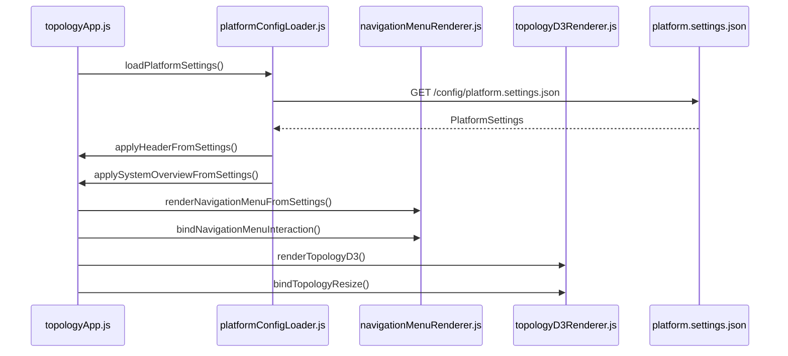

# Independent D3 Topology Page

Standalone topology view at **`http://localhost:8080/topology-d3/`**.

Decoupled from the legacy RequireJS stack (`src/msdh/code.js`). Driven entirely by **`mock-client/config/platform.settings.json`**.

> **The GUI covers full device lifecycle management:** provisioning, RF routing, device monitoring, alarms, configuration backup, software update, and system administration.

See also: [Full analysis](GITHUB.md) · [Mock server README](../mock-client/README.md)

---

## Page layout

```
┌─ HEADER (50px, fixed) ──────────────────────────────────────────────────────┐
│ COBHAM │ idDAS │ Topology — site-01 │ versions │ sysadmin │ logout          │
│ [hover → full navigation menu with lifecycle tagline]                         │
├─ SYSTEM OVERVIEW (whitesmoke panel) ──────────────────────────────────────────┤
│ Routing profile: oper1 │ Operator ▼ │ Display mode ▼ │ user │ system LED ●  │
├─ TOPOLOGY CANVAS (#f5f5f5) ──────────────────────────────────────────────────┤
│ Layer 1: BTS Port Group          [red LED]                                  │
│ Layer 2: Axell Point of Interface [green LED]                               │
│ Layer 3: Multi Technology Digital Interface [red LED, 4 devices]            │
│ Layer 4: Multi Sector Digital Hub [green LED, 2 devices]                    │
└─────────────────────────────────────────────────────────────────────────────┘
```

---

## Bootstrap flow



---

## Module reference

### `topologyApp.js`

Entry point. Wires settings → UI → D3. Handles display mode and operator change events (operator change re-renders static JSON today).

### `platformConfigLoader.js`

| Export | Binds to DOM |
|--------|--------------|
| `loadPlatformSettings()` | — |
| `applyHeaderFromSettings()` | `#header-text-title`, `#header-text-username`, `#header-text-version-number` |
| `applySystemOverviewFromSettings()` | `#routing_setup_select`, `#operator_list`, `#display_filter_list`, `#username` |

### `navigationMenuRenderer.js`

| Export | Behavior |
|--------|----------|
| `renderNavigationMenuFromSettings()` | Builds `#header-link-list` from `navigationMenu` |
| `bindNavigationMenuInteraction()` | 500ms hover delay; iPad tap-to-open |

Menu order: **target sections first** (Wizards, RF, Devices, System Admin), then **common sections** (Alarms, Others) — same as legacy `src/js/header.js` prepending `/target/header.html`.

### `topologyD3Renderer.js`

| Export | Behavior |
|--------|----------|
| `computeDeviceSeverity()` | Comm/Status → 0–4 severity |
| `computeLayerSeverity()` | Worst device severity in layer |
| `renderTopologyD3()` | Full SVG render |
| `bindTopologyResize()` | Re-render on `window.resize` |

---

## `platform.settings.json` — topology section

### Layer structure

```json
{
  "layerId": "MTDI",
  "layerLabel": "Multi Technology Digital Interface",
  "layerOrder": 3,
  "layerSeverity": 0,
  "devices": [
    {
      "deviceId": "MTDI_001",
      "deviceTag": "MTDI-1",
      "nodeType": "MTDI",
      "commCode": "0",
      "statusCode": "0",
      "locationTag": "Rack-1",
      "nodeOrder": 1,
      "severity": 0
    }
  ]
}
```

### Node types and icons

| `nodeType` | Layer title | Icon path |
|------------|-------------|-----------|
| `SECTGRP` | BTS Port Group | `/images/icons/sectgrp_icon.png` |
| `APOI` | Axell Point of Interface | `/images/icons/APOI_bigicon.png` |
| `MTDI` | Multi Technology Digital Interface | `/images/icons/MTDI_bigicon.png` |
| `MSDH` | Multi Sector Digital Hub | `/images/icons/MSDH_bigicon.png` |
| `ZONE` | idRemote | `/images/icons/zone_icon.png` |

### Severity model

| `commCode` | `statusCode` | LED color |
|------------|--------------|-----------|
| `1` | any | Red (comm fail) |
| `0` | `0` | Red (alarm) |
| `0` | `1` | Orange (warning) |
| `0` | `2` | Yellow (minor) |
| `0` | `3` | White (info) |
| `0` | `4` | Green (ok) |
| `-` | not `1` | Green (unknown comm) |

Gradients defined in `severityModel.gradientStops`.

---

## Navigation menu JSON

### Tagline

```json
"menuTagline": "The GUI covers full device lifecycle management:"
```

### Menu item fields

| Field | Required | Description |
|-------|----------|-------------|
| `menuItemId` | yes | Logical ID |
| `menuItemLabel` | yes | Display text |
| `href` | yes | Link target (`/target/*` or common path) |
| `iconClass` | yes | CSS icon class from `icons.css` |
| `menuItemTitle` | no | Tooltip (legacy `title` attr) |
| `menuItemDomId` | no | Legacy DOM `id` (e.g. `apoi_management`) |
| `hideForNonSysadmin` | no | Hide unless username is `sysadmin` |
| `hideForReadOnly` | no | Hide when `userAccess === "RO"` |

### Section fields

| Field | Description |
|-------|-------------|
| `menuSectionId` | `<ul id="...">` |
| `menuSectionHeaderDomId` | `<li id="...">` (e.g. `wizards` for Wizards) |
| `menuSectionLabel` | Section heading text |

---

## Naming conventions

| Layer | Convention | Example |
|-------|------------|---------|
| JSON keys | camelCase | `layerId`, `routingProfileValue` |
| Legacy DOM `id` | snake_case | `#topology-container` |
| D3 SVG `id` | legacy parity | `SECTGRP_overall-status` |
| JS modules | camelCase | `topologyD3Renderer.js` |
| JS constants | SCREAMING_SNAKE | `PLATFORM_SETTINGS_URL`, `MENU_HOVER_DELAY_MS` |

---

## vs legacy `msdh/code.js`

| Feature | Legacy | D3 page |
|---------|--------|---------|
| Data source | axsh CGI commands | Static JSON |
| jsPlumb connections | Yes | No |
| Node popup | Yes | No |
| Polling (20s) | Yes | No |
| Rack View | Yes | Stub |
| Zoom | Yes | Yes |
| Layer headers + LEDs | Yes | Yes |
| Menu | AJAX HTML | JSON renderer |

---

## Edit checklist

1. Update `mock-client/config/platform.settings.json`
2. Reload http://localhost:8080/topology-d3/
3. For menu changes: check hover on header bar
4. For topology changes: verify layer order, severity, icon paths
5. For toolbar: edit `systemOverviewBar` section

Do **not** hardcode topology data in `topologyD3Renderer.js`.

---

## Known gaps

- `sectgrp_icon.png` may 404 in repo
- Operator dropdown does not fetch different topology data
- Rack View logs stub message to console
- No connection lines between layers
- `platform.settings.schema.json` not yet created
